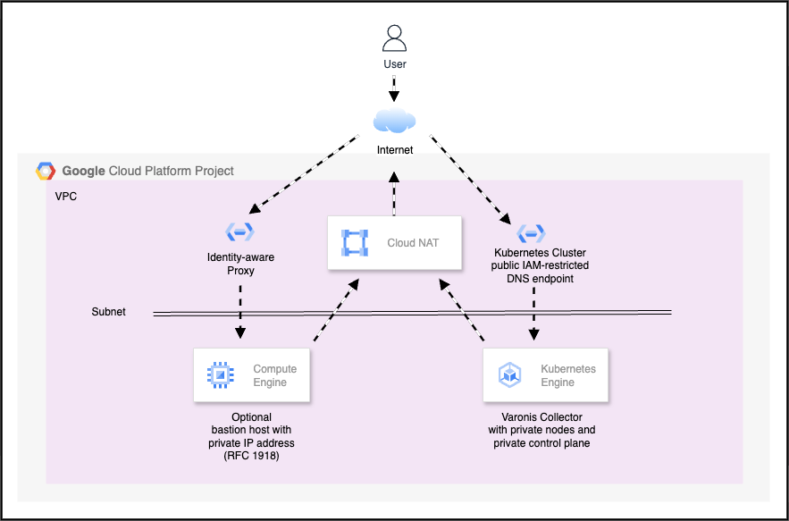

# Back to the Basics - Building a GKE Cluster with Terraform for Varonis

> [!NOTE]
> This is not an official publication of any business.
> The opinions  expressed are solely those of the author.
> The author makes no warranty and assumes no liability for the content.

# Introduction

Google Cloud customers of [Varonis](https://www.varonis.com/blog/meet-datadvantage-cloud)
can use [Google Kubernetes Engine](https://cloud.google.com/kubernetes-engine?hl=en) ("GKE")
to host private
[collectors](https://www.varonis.com/blog/data-scanning#:~:text=Varonis%20offers%20both%20full%20SaaS,attack%20surface%2C%20and%20increasing%20control.) to provide data security posture management ("DSPM") capabilities.
The containers in these collectors analyze a customer's cloud assets within in the customers' Google Cloud environments
and send asset metadata to Varonis where it is correlated with user
activities to provide customers with insights about their data security,
without sending actual data out of the customer's Google Cloud environment.

In this article we revisit GKE basics and show how to create a collector environment for Varonis using
a private GKE cluster and an optional
bastion host in Google Cloud using Terraform code from a GitHub repository.
Using a private cluster means that the GKE nodes and control plane will not have publicly
addressible IP addresses.
You can access the cluster using the [DNS endpoint](https://cloud.google.com/kubernetes-engine/docs/concepts/network-isolation#dns-based_endpoint) whose access is brokered by IAM.
This is  similar to what the Identity-aware Proxy does for Compute Engine instances and provides an additional layer  of security.
A high level diagram of the infrastructure created by the Terraform code appears below.



Why a bastion host?

The creation of a bastion host is optional.
A bastion host is useful if you do not have access to utilities such as
[`kubectl`](https://kubernetes.io/docs/reference/kubectl/).
The bastion host also contains common tools for working with databases.

# Prerequisites, assumptions, caveats, etc.

1. You will need a Google Cloud project in which the GKE cluster (and optional
bastion host) will be created.

1. You will use the [Google Cloud CLI](https://cloud.google.com/cli?hl=en) (`gcloud`).

1. You must have the roles listed below.

    * Compute Admin (roles/compute.admin)

        This permission is needed to manage Google Compute Engine instances.

    * Compute Network Admin (roles/compute.networkAdmin)

        This permission is needed to manage VPC networks.

    * Kubernetes Engine Admin (roles/container.admin)

        This permission is needed to manage GKE.

    * Service Usage Admin (roles/serviceusage.serviceUsageAdmin)

        This permission is needed to enable APIs

1.  These instructions assume you are familiar with the skills listed below.

    * Terraform
    * Google Cloud core concepts (e.g. APIs, projects)
    * The Google Cloud CLI (gcloud)

1. The instructions only cover the installation of Google Cloud infrastructure,
not Varonis components.

# Instructions

These instructions are written assuming that your workstation is set up with the
Google Cloud CLI.
You can use these instructions in the Cloud Shell as well.
If you are using Windows, you will need to adapt these instructions.

## Set up

The steps in this section 

1. Clone [this repository](https://github.com/jeffscottlevine/gke-cluster-varonis) and change your working directory to the directory into which the repository was cloned.

1. If you have not already done so, authenticate to Google Cloud and set your application default credentials.
    ```
    gcloud auth login --update-adc
    ```

1. Set the environment variable REPODIR to the repository base directory using the command below.

    ```
    export REPODIR=`pwd`
    ```

1. Set the environment variable PROJECT_ID to the repository base directory using the command below.

    ```
    export PROJECT_ID=INSERT_YOUR_PROJECT_ID_HERE
    ```

1. Set your current Google Cloud project ID

    ```
    gcloud config set project $PROJECT_ID
    ```

1. Set your Google Cloud billing/quota project.

    ```
    gcloud auth application-default set-quota-project $PROJECT_ID
    ```

## Enable APIs

Before the GKE cluster and optional bastion host are built, you will use
Terraform code to enable the APIs below.

* Cloud Resource Manager (<span>cloudresourcemanager.googleapis.com</span>)
* Compute Engine (<span>compute.googleapis.com</span>)
* Kubernetes Engine (<span>container.googleapis.com</span>)
* Identity & Access Management (IAM) (<span>iam.googleapis.com</span>)
* Identity-aware Proxy (IAP) (<span>iap.googleapis.com</span>)
* Cloud Logging (<span>logging.googleapis.com</span>)
* OS Login (<span>oslogin.googleapis.com</span>)
* Service Usage (<span>serviceusage.googleapis.com</span>)

1. Move to the subdirectory with the appropriate Terraform code.

    ```
    cd $REPODIR/enableAPIs
    ```

1. Create the terraform.tfvars file from the template.

    ```
    cp terraform.tfvars.example terraform.tfvars
    ```

1. Open the file `terraform.tfvars` with a text editor.
Replace `your-project-id-goes-here` with your Google Cloud project id.
Do not delete the quotation marks.
Save the file.

1. Initialize Terraform.

    ```
    terraform init
    ```

1. Create the Terraform plan.

    ```
    terraform plan --out=plan.out
    ```

1. Apply the Terraform plan to enable the APIs.

    ```
    terraform apply plan.out
    ```

    Terraform should complete in 1-2 minutes.
    The required APIs are now built.

## Build the GKE cluster and optional bastion host

1. Move to the subdirectory with the appropriate Terraform code.

    ```
    cd $REPODIR
    ```

1. Create the terraform.tfvars file from the template.

    ```
    cp terraform.tfvars.example terraform.tfvars
    ```

1. Open the file `terraform.tfvars` with a text editor.
The file contains several variables that you can set that are
described below.
Retain all quotation marks in the variable definitions.

    `project_id` (Required, string) Replace `your-project-id-goes-here` with your Google Cloud project id.
    This is the only required change.

    `region` (optional, string, default="us-central1") The region for the GKE cluster and optional bastion
    host.

    `create_bastion_host` (optional, boolean, default="false") Set this value to "true" if you want to create a bastion host.

    `bastion_zone` (optional, boolean, default="false") Set this to the zone for the optional bastion host.
    This zone must be part of the region defined by the `region` variable.

    `gke_location` (optional, string, default="us-central1-a") Set this to the location of the GKE cluster.
    You can specify a region or zone.
    If a region is specified, it must be the same as the region as the `region` variable.
    If a zone is specified, it must belong to the region specified by the `region` variable.

    `gke_node_count` (optional, numeric, default=2) The number of nodes to have per zone of the GKE cluster.
    If the cluster is regional, this variable will be multiplied by the number of zones in the region to
    get the total number of nodes.

    Read about the additional variables and make changes as needed.

1. Save the file with your changes.


1. Initialize Terraform.

    ```
    terraform init
    ```

1. Create the Terraform plan.

    ```
    terraform plan --out=plan.out
    ```

1. Apply the Terraform plan to enable the APIs.

    ```
    terraform apply plan.out
    ```

    Terraform should complete in 10-15 minutes.
    If you are running this command in the Cloud Shell, remember tha the Cloud Shell will terminate if the keyboard is idle for more than five minutes.
    Press the Enter/Return key every few minutes to keep the Cloud Shell from terminating.

## Terraform outputs

Terraform will display output after the completion of the build.
You can redisplay these outputs with the command below.

```
terraform output
```

An example of the output appears below.
You may need to scroll horizontally to see the entire command and its output.

```
Bastion_host_instance_id = "varonis-bastion-3tcj"
Bastion_ssh = "gcloud compute ssh --zone us-central1-a varonis-bastion-3tcj --tunnel-through-iap --project YOUR_PROJECT_ID"
GKE_cluster_DNS_endpoint = "gke-LONG_STRING.us-central1-a.gke.goog"
GKE_cluster_get_creds = "gcloud container clusters get-credentials varonis-gke-cluster-3tcj --dns-endpoint --location us-central1-a"
GKE_cluster_name = "varonis-gke-cluster-3tcj"
NAT_ip = "#.#.#.#"
Random_suffix = "3tcj"
ZZZ_SSH_Msg = <<EOT
*********************************************************************
*                                                                   *
* Please grant the IAM role below to users at the orgination or     *
* project level of the resource hierarchy to enable users to SSH    *
* into the GKE nodes and optional bastion host.                     *
*                                                                   *
* IAP-secured Tunnel User (roles/iap.tunnelResourceAccessor)        *
*                                                                   *
*********************************************************************
EOT
```

`Bastion_host_instance_id` is the id of the instance associated with the bastion host
The value is defined only if the Terraform variable `create_bastion_host` is set to `true`.

`Bastion_ssh` is the command used to access the bastion host.
The value is defined only if the Terraform variable `create_bastion_host` is set to `true`.

`GKE_cluster_DNS_endpoint` is the DNS endpoint of the GKE cluster.

`GKE_cluster_get_creds` is the command to fetch the GKE cluster credentials and store them
in your Kubernetes configuration director, by default `$HOME/.kube/config`.
You must do this before running commands such as `kubectl`.

`GKE_cluster_name` is the name of the GKE cluster.

`NAT_ip` is the IP address of the NAT gateway that is created to allow the GKE cluster and
optional bastion hast to have internet access.

`Random_suffix` is a set of characters generated when Terraforms runs that is appended to
Google Cloud resources.
Using a random suffix allows more multiple builds to happen within the same Google Cloud
project.

`ZZZ_SSH_Msg` is a reminder to users of this Terraform build to ensure that the appropriate
permissions are granted to enable ssh logins to the GKE nodes and optional bastion
host.

# Using the GKE cluster

1. In the Terraform outputs from the installation, copy the value of the `GKE_cluster_get_creds`.
Do not include the quotation marks.
Paste this value into your command interpreter and execute it.
An example of this command and its output appear below.
You may need to scroll horizontally to see the entire command and its output.

    ```
    gcloud container clusters get-credentials varonis-gke-cluster-3tcj --dns-endpoint --location us-central1-a`
    Fetching cluster endpoint and auth data.
    kubeconfig entry generated for varonis-gke-cluster-gsoq.
    ```

1. You can now execute commands against the cluster such as `kubectl`.

# Using the bastion host

1. If you created a bastion host, In the Terraform outputs from the installation, copy the value of the `Bastion_ssh`.
    Do not include the quotation marks.
    Paste this value into your command interpreter and execute it.
    An example of this command appears below.
    You may need to scroll horizontally to see the entire command and its output.

    ```
    gcloud compute ssh --zone us-central1-a varonis-bastion-3tcj --tunnel-through-iap --project YOUR_PROJECT_ID
    ```

1. If you would like to connect to the cluster, you can use the command contaained in the `GKE_cluster_get_creds` output variable.
    You can also run the file /tmp/get_gke_creds which contains the command.

# Cleaning up


1. Change to the directory in which the Terraform code has been installed.

```
cd $REPODIR
```

2. Enter the command below to destroy the resources.

```
terraform destroy
```

3. Confirm the action by entering `yes` when prompted.

# Common errors

1. A message saying something like `Error: Error when reading or editing` usually means that your login credentials have expired.
Reauthenticating as described in the set up instructions often fixes this.
